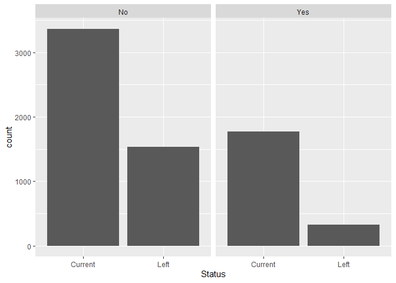
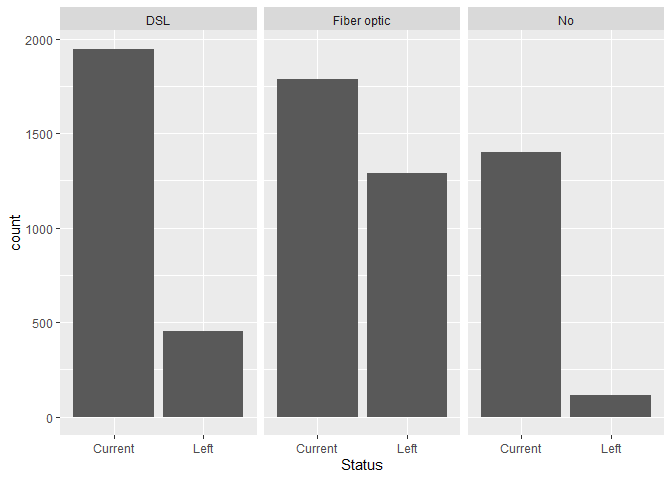
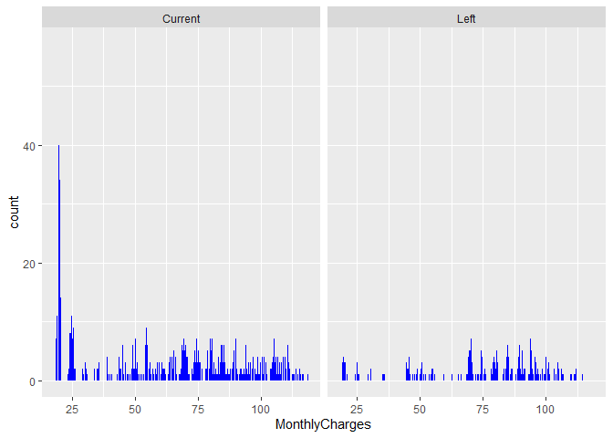
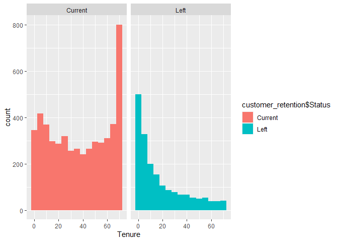
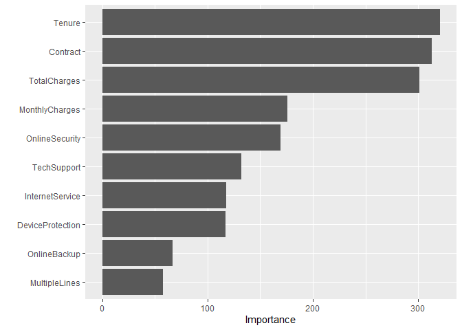
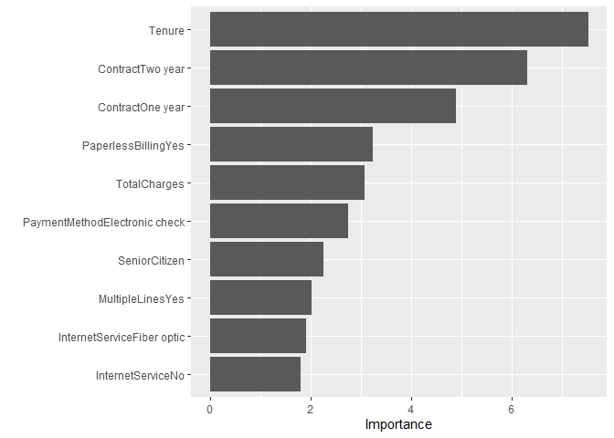
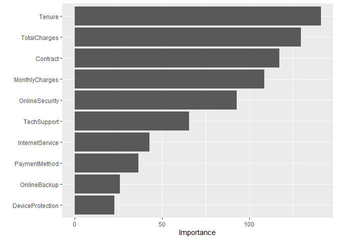

Data Mining Final Project
================
Louis Denko
2023-11-28

``` r
library(tidyverse)
library(tidymodels)
library(vip)
library(here)
library(pdp)
```

``` r
customer_retention <- read_csv('customer_retention.csv')
```

## Data Prep and Exploratory Analysis

``` r
customer_retention %>% 
  summarise(across(everything(), ~ sum(is.na(.))))
```

    ## # A tibble: 1 × 20
    ##   Gender SeniorCitizen Partner Dependents Tenure PhoneService MultipleLines
    ##    <int>         <int>   <int>      <int>  <int>        <int>         <int>
    ## 1      0             0       0          0      0            0             0
    ## # ℹ 13 more variables: InternetService <int>, OnlineSecurity <int>,
    ## #   OnlineBackup <int>, DeviceProtection <int>, TechSupport <int>,
    ## #   StreamingTV <int>, StreamingMovies <int>, Contract <int>,
    ## #   PaperlessBilling <int>, PaymentMethod <int>, MonthlyCharges <int>,
    ## #   TotalCharges <int>, Status <int>

``` r
customer_retention %>%
  filter(is.na(TotalCharges))
```

    ## # A tibble: 11 × 20
    ##    Gender SeniorCitizen Partner Dependents Tenure PhoneService MultipleLines   
    ##    <chr>          <dbl> <chr>   <chr>       <dbl> <chr>        <chr>           
    ##  1 Female             0 Yes     Yes             0 No           No phone service
    ##  2 Male               0 No      Yes             0 Yes          No              
    ##  3 Female             0 Yes     Yes             0 Yes          No              
    ##  4 Male               0 Yes     Yes             0 Yes          Yes             
    ##  5 Female             0 Yes     Yes             0 No           No phone service
    ##  6 Male               0 Yes     Yes             0 Yes          No              
    ##  7 Male               0 Yes     Yes             0 Yes          Yes             
    ##  8 Female             0 Yes     Yes             0 Yes          No              
    ##  9 Male               0 Yes     Yes             0 Yes          No              
    ## 10 Female             0 Yes     Yes             0 Yes          Yes             
    ## 11 Male               0 No      Yes             0 Yes          Yes             
    ## # ℹ 13 more variables: InternetService <chr>, OnlineSecurity <chr>,
    ## #   OnlineBackup <chr>, DeviceProtection <chr>, TechSupport <chr>,
    ## #   StreamingTV <chr>, StreamingMovies <chr>, Contract <chr>,
    ## #   PaperlessBilling <chr>, PaymentMethod <chr>, MonthlyCharges <dbl>,
    ## #   TotalCharges <dbl>, Status <chr>

``` r
customer_retention <- customer_retention %>%
  na.omit()
```

Removed Rows that contained NA values which were all in Total Charges

``` r
customer_retention %>%
  select(Status, Dependents) %>%
  group_by(Status) %>%
  ggplot(aes(Status)) +
  geom_bar() +
  facet_wrap(~Dependents)
```

<!-- -->

``` r
customer_retention %>%
  ggplot(aes(Status)) +
  geom_bar() +
  facet_wrap(~InternetService)
```

<!-- -->

``` r
customer_retention %>%
  ggplot(aes(MonthlyCharges)) +
  geom_bar(fill='blue') +
  facet_wrap(~Status)
```

<!-- -->

``` r
customer_retention %>%
  ggplot(aes(Tenure, fill = customer_retention$Status)) +
  geom_histogram(binwidth = 5) +
  facet_wrap(~Status)
```

    ## Warning: Use of `customer_retention$Status` is discouraged.
    ## ℹ Use `Status` instead.

<!-- -->

### Splitting Data

``` r
customer_retention <- customer_retention %>%
  mutate(Status = factor(Status))

set.seed(111)
cr_split <- initial_split(customer_retention, prop = .7, strata = Status)
cr_train <- training(cr_split)
cr_test <- testing(cr_split)
```

### Decision Tree

``` r
dt_recipe <- recipe(
  Status ~ ., 
  data = cr_train
)

set.seed(111)
dt_kfold <- vfold_cv(v=10, data=cr_train,strata = Status)

dt_model <- decision_tree(
  mode = 'classification',
  cost_complexity = tune(),
  tree_depth = tune(),
  min_n = tune()
)

dt_hyper_grid <- grid_regular(
  cost_complexity(),
  tree_depth(),
  min_n()
)

dt_results <- tune_grid(dt_model, dt_recipe, resamples = dt_kfold, grid = dt_hyper_grid)
```

    ## Warning: package 'rpart' was built under R version 4.2.3

``` r
show_best(dt_results, metric = 'roc_auc')
```

    ## # A tibble: 5 × 9
    ##   cost_complexity tree_depth min_n .metric .estimator  mean     n std_err
    ##             <dbl>      <int> <int> <chr>   <chr>      <dbl> <int>   <dbl>
    ## 1    0.0000000001          8    21 roc_auc binary     0.818    10 0.00604
    ## 2    0.00000316            8    21 roc_auc binary     0.818    10 0.00604
    ## 3    0.0000000001          8    40 roc_auc binary     0.814    10 0.00764
    ## 4    0.00000316            8    40 roc_auc binary     0.814    10 0.00764
    ## 5    0.0000000001         15    40 roc_auc binary     0.813    10 0.00652
    ## # ℹ 1 more variable: .config <chr>

``` r
dt_best_model <- select_best(dt_results, 'roc_auc')

dt_final_wf <- workflow() %>%
  add_recipe(dt_recipe) %>%
  add_model(dt_model) %>%
  finalize_workflow(dt_best_model)

dt_final_fit <- dt_final_wf %>%
  fit(data=cr_train)


dt_final_fit %>%
  extract_fit_parsnip() %>%
  vip()
```

<!-- -->

``` r
dt_final_fit %>%
  predict(cr_test) %>%
  bind_cols(cr_test %>% select(Status)) %>%
  conf_mat(truth = Status, estimate = .pred_class)
```

    ##           Truth
    ## Prediction Current Left
    ##    Current    1336  272
    ##    Left        204  285

### Logistic Regression

``` r
lr_model <- logistic_reg() 

lr_recipe <- recipe(Status ~., data=cr_train)

set.seed(111) 
lr_kfold <- vfold_cv(v=10, strata = Status, data=cr_train)

lr_fit <- workflow() %>%
  add_recipe(lr_recipe) %>%
  add_model(lr_model) %>%
  fit_resamples(lr_kfold)
```

    ## → A | warning: prediction from a rank-deficient fit may be misleading

    ## There were issues with some computations   A: x1There were issues with some computations   A: x3There were issues with some computations   A: x4There were issues with some computations   A: x5There were issues with some computations   A: x6There were issues with some computations   A: x7There were issues with some computations   A: x9There were issues with some computations   A: x10

``` r
lr_fit %>%
  collect_metrics() %>%
  filter(.metric == 'roc_auc')
```

    ## # A tibble: 1 × 6
    ##   .metric .estimator  mean     n std_err .config             
    ##   <chr>   <chr>      <dbl> <int>   <dbl> <chr>               
    ## 1 roc_auc binary     0.842    10 0.00595 Preprocessor1_Model1

``` r
lr_best_parameters <- select_best(lr_fit, metric = 'roc_auc')

lr_final_wf <- workflow() %>%
  add_recipe(lr_recipe) %>%
  add_model(lr_model) %>%
  finalize_workflow(lr_best_parameters)

lr_final_model <- lr_final_wf %>%
  fit(data=cr_train) %>%
  extract_fit_parsnip()
 
vip(lr_final_model$fit)
```

<!-- -->

``` r
lr_final_model %>%
  predict(cr_test) %>%
  bind_cols(cr_test %>% select(Status)) %>%
  conf_mat(truth = Status, estimate = .pred_class)
```

    ##           Truth
    ## Prediction Current Left
    ##    Current    1369  236
    ##    Left        171  321

### Random Forest

``` r
rf_recipe <- recipe(Status ~ ., data= cr_train)

rf_model <- rand_forest(
  mode = 'classification',
  trees = tune(),
  mtry = tune(),
  min_n = tune()) %>%
  set_engine('ranger', importance = 'impurity')

set.seed(111)
kfold <- vfold_cv(cr_train, v=5)

hyper_grid <- grid_regular(
  trees(range = c(100,300)),
  mtry(range = c(1,15)),
  min_n(),
  levels = 5
)

set.seed(111)
rf_results <-  tune_grid(rf_model, rf_recipe, resamples = kfold, grid = hyper_grid)
```

    ## Warning: package 'ranger' was built under R version 4.2.3

``` r
show_best(rf_results, metric = 'roc_auc')
```

    ## # A tibble: 5 × 9
    ##    mtry trees min_n .metric .estimator  mean     n std_err .config              
    ##   <int> <int> <int> <chr>   <chr>      <dbl> <int>   <dbl> <chr>                
    ## 1     4   200    40 roc_auc binary     0.840     5 0.00553 Preprocessor1_Model1…
    ## 2     4   250    40 roc_auc binary     0.840     5 0.00550 Preprocessor1_Model1…
    ## 3     4   300    40 roc_auc binary     0.840     5 0.00519 Preprocessor1_Model1…
    ## 4     4   150    40 roc_auc binary     0.840     5 0.00514 Preprocessor1_Model1…
    ## 5     4   100    40 roc_auc binary     0.840     5 0.00469 Preprocessor1_Model1…

``` r
best_rf_hyperparameters <- select_best(rf_results, metric = 'roc_auc')

final_rf_wf <- workflow() %>%
  add_recipe(rf_recipe) %>%
  add_model(rf_model) %>%
  finalize_workflow(best_rf_hyperparameters)

final_rf_fit <- final_rf_wf %>%
  fit(data = cr_train)

final_rf_fit %>%
  extract_fit_parsnip() %>%
  vip()
```

<!-- -->

``` r
final_rf_fit %>%
  predict(cr_test) %>%
  bind_cols(cr_test %>% select(Status)) %>%
  conf_mat(truth = Status, estimate = .pred_class)
```

    ##           Truth
    ## Prediction Current Left
    ##    Current    1410  275
    ##    Left        130  282
