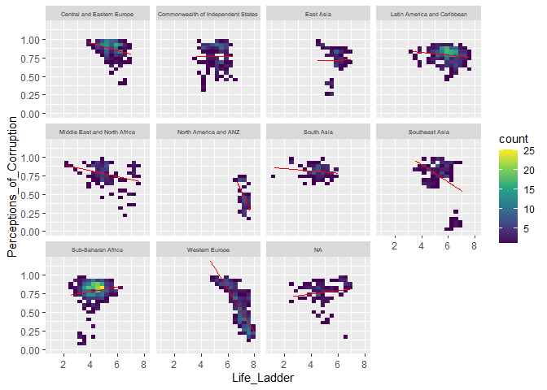
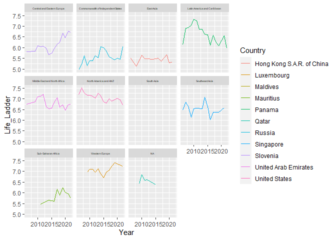

World Happiness Report Project
================
Louis Denko
2023-04-15

# Report

## Variable Descriptions

### Country Name

The Name of each country

### Regional Indicator

What region the country is located

### Year

Year of data collected

### Life Ladder

A score out of ten of based on Gallop Survey Data on how generally good
life is in the country. The number presented is an average of each
counties responses.

### Log GDP per Capita

The natural log of each countries GDP to better fit the data

### Social Support

Country average of responses to if people feel as though they have
friends or family to support them. Responses were Binary.

### Healthy Life Expectancy at Birth

The life expectancy each year

### Freedom to Make Life Choices

Country average of responses to are people satisfied with their freedom
to choose what they do in their lives. Responses were Binary

### Generosity

The residual value after regression based on the national average to the
question have you made a charitable donation

### Perceptions of Corruption

Average of responses to is there widespread corruption in the
government/businesses. Both of these were binary questions

### Positive Affect

Measure that asks whether the respondent experienced certain positive
feelings during the previous day

### Negative Affect

Measure that asks whether the respondent experienced certain negative
feelings during the previous day

### Confidence in National Government

The percentage of people that said they at least sometimes have
confidence in their government

### Row Description

Each row represents a country for each year

### NA Values

Many of the NA values are from the region variable, so some counrties do
not have a region listed. Many of these contries, such as Oman, and
Syria ae located in the middle east, though not all.

``` r
n_distinct(World_Happiness_Report$Year)
```

    ## [1] 18

``` r
World_Happiness_Report %>%
  select(everything()) %>%
  summarize_all(funs(sum(is.na(.))))
```

    ## # A tibble: 1 × 13
    ##   `Country Name` `Regional Indicator`  Year `Life Ladder` `Log GDP Per Capita`
    ##            <int>                <int> <int>         <int>                <int>
    ## 1              0                  112     0             0                   20
    ## # ℹ 8 more variables: `Social Support` <int>,
    ## #   `Healthy Life Expectancy At Birth` <int>,
    ## #   `Freedom To Make Life Choices` <int>, Generosity <int>,
    ## #   `Perceptions Of Corruption` <int>, `Positive Affect` <int>,
    ## #   `Negative Affect` <int>, `Confidence In National Government` <int>

## Question 1

How does corruption impact a counties’ happiness?

``` r
WHR %>%
  ggplot() +
   geom_bin2d(aes(x = Life_Ladder, y = Perceptions_of_Corruption), bins = 20) +
  scale_fill_viridis_c() +
  geom_smooth(aes(x = Life_Ladder, y = Perceptions_of_Corruption,), method = 'lm', color = 'red', linewidth = .5, se = FALSE) +
  facet_wrap(~Region) +
  theme(
    strip.text.x = element_text(size = 5))
```

    ## `geom_smooth()` using formula = 'y ~ x'

<!-- --> We can see that
generally there is a negative correlation between these two variables.
The most extreme case of this is within Western Europe. It might be
assumed that this is because of the history some countries have with
having very corrupt governments. Oddly, there are a couple regions that
have a positive correlation, though they are only slightly positive. It
it likely these countries may be content with some corruption in their
governments as they may still feel they are being well represented.

## Question 2

How has the happiness the countries with the highest gdp chnaged over
time?

``` r
WHR %>%
  group_by(Country, Region) %>%
  mutate(avg_GPD = mean(Log_GDP_per_Capita)) %>%
  ungroup() %>%
  mutate(Year = as.integer(Year)) %>%
  group_by(Region) %>%
  top_n(1, avg_GPD) %>%
  arrange(desc(avg_GPD)) %>%
  ggplot()+
  geom_line(aes(x = Year, y = Life_Ladder, color = Country))+
  facet_wrap(~Region) +
  theme(
    strip.text.x = element_text(size = 4))
```

    ## `geom_line()`: Each group consists of only one observation.
    ## ℹ Do you need to adjust the group aesthetic?

<!-- -->

The pattern here is not as clear, though North America stands out as it
was been on a fairly constant decline since 2008. We also notice that a
lot of the countries have a decline since 2020. This is likely because
of the covid pandemic, and while life has returned much more to normal,
things such as bad economy or even work environments may still leave
people feeling unhappy.
